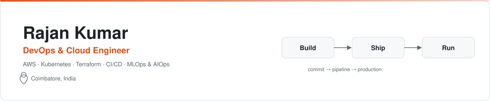
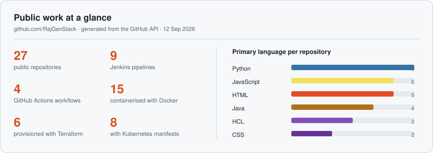

<picture>
  <source media="(prefers-color-scheme: dark)" srcset="assets/banner-dark.svg">
  
</picture>

## About me

I build and automate the path from a commit to a running service: pipelines in Jenkins and GitHub Actions, infrastructure as code with Terraform, containers on Kubernetes (EKS), and the monitoring that says when something breaks. Most of that work sits on AWS, and I am extending it into MLOps and AIOps.

Everything below is public and reproducible: each repository documents its architecture, how to run it, and where its ideas came from.

- **Working on** serverless and self-healing systems, and end-to-end MLOps pipelines
- **Learning** advanced Kubernetes and Terraform
- **Open to** collaboration on cloud, CI/CD, ML pipeline and automation projects
- **Reach me** at [rajansofficiall@gmail.com](mailto:rajansofficiall@gmail.com)

<picture>
  <source media="(prefers-color-scheme: dark)" srcset="assets/stats-dark.svg">
  
</picture>

## Featured projects

| Project | What it is | Built with |
|---|---|---|
| **[Aegis](https://github.com/RajGenStack/aegis-self-healing-triage)** | Serverless patient-triage pipeline that scores vital signs, injects its own outages and repairs itself automatically | AWS Lambda · SQS · DynamoDB · EventBridge · Terraform · React |
| **[Multibranch GitOps](https://github.com/RajGenStack/Production-Grade-CI-CD-Pipeline-with-Jenkins-Multibranch-GitOps)** | Feature branches to production on EKS: immutable image tags, manifest commits and Argo CD reconciliation | Jenkins · Docker · Argo CD · Amazon EKS |
| **[Lumio](https://github.com/RajGenStack/YouTube-Video-Downloader-LUMIO)** | Media downloader with a typed FastAPI backend and a DevSecOps delivery pipeline | FastAPI · yt-dlp · FFmpeg · Docker · Jenkins · SonarQube · Trivy |
| **[Sentiment MLOps](https://github.com/RajGenStack/End-to-End-Sentiment-Analysis-MLOps)** | YouTube comment sentiment, from tracked experiments to a served model and a Chrome extension | MLflow · DVC · LightGBM · Flask · AWS ECR and EC2 |
| **[CareerCompass](https://github.com/RajGenStack/career-compass)** | Career-path quiz with accounts and saved results, deployed to EC2 from GitHub Actions | Flask · MySQL · Docker Compose · GitHub Actions |
| **[Portfolio](https://github.com/RajGenStack/new-projectsx-2004)** | Full-stack portfolio with AI assistants and three languages, behind Nginx with TLS | React · Node.js · MongoDB · Groq · Nginx |

## More projects and labs

Several of these follow DevOps courses or open-source references; each README credits its source.

| Area | Repositories |
|---|---|
| **Kubernetes on EKS** | [ALB Controller routing](https://github.com/RajGenStack/aws-lb-controller-domain-configuration-RJS) · [NGINX Ingress + Argo CD](https://github.com/RajGenStack/Microservices-Deployment-with-Ingress-Helm-and-Argo-CD) · [EKS with Terraform](https://github.com/RajGenStack/Automated-EKS-Provisioning-on-AWS-using-Terraform-and-Jenkins) · [Ticketing app to EKS](https://github.com/RajGenStack/Deployment-of-Online-Ticketing-and-Event-Management-Application) · [E-commerce to EKS](https://github.com/RajGenStack/Deployment-Of-E-Commerce-Application) · [Blogging app on EKS](https://github.com/RajGenStack/fullstack-project) |
| **DevSecOps pipelines** | [Wanderlust: Jenkins + GitOps](https://github.com/RajGenStack/CI-CD-Pipeline-project) · [Food ordering app](https://github.com/RajGenStack/Deployment-of-Food-Ordering-and-Delivery-Application) · [Exam app](https://github.com/RajGenStack/Python-Exam-App-Devops) |
| **CI/CD fundamentals** | [GitHub Actions to EC2](https://github.com/RajGenStack/GitHub-Actions-Project-Java) · [Jenkins to Tomcat](https://github.com/RajGenStack/Pipeline-NETFLIX-Project) · [Maven WAR with SonarQube](https://github.com/RajGenStack/Disney-HotStar-Application) · [Multi-module Maven build](https://github.com/RajGenStack/register) |
| **Infrastructure and automation** | [3-tier VPC with Terraform](https://github.com/RajGenStack/Built-a-Scalable-AWS-3-Tier-Architecture-with-Terraform) · [3-tier web app on AWS](https://github.com/RajGenStack/Deployment-of-3-TierArchitecture-web-App-in-AWS) · [EC2 CI toolchain](https://github.com/RajGenStack/Scripts-Terraform-AWS) · [AWS account cleanup with boto3](https://github.com/RajGenStack/boto3-aws-cleanup) |
| **Web and templates** | [Portfolio (single page)](https://github.com/RajGenStack/portfoliowebsite) · [Static site templates](https://github.com/RajGenStack/glacro-templates) · [Boutique site](https://github.com/RajGenStack/nj-fashion-boutique) |

## Tech stack

| Area | Tools |
|---|---|
| **Cloud** |    |
| **Containers** |    |
| **CI/CD and GitOps** |     |
| **Infrastructure as code** |   |
| **Observability** |    |
| **Security and quality** |    |
| **Languages** |      |
| **MLOps and APIs** |       |
| **Databases** |      |
| **Tools** |     |

The banner and stats card above are generated into this repository by <a href="scripts/generate_stats.py">scripts/generate_stats.py</a>, so nothing here depends on a third-party image service staying online.

